# FastAPI Full-stack

This is <b>my first Go Full-stack project with Gorilla Mux API - CRM (Customer relationship management) application.</b> 
 
The application uses <b>Golang</b> with the <b>MySQL</b> database as backend.   <b>The application works both as a standalone api (http://127.0.0.1:8000/infos route) and as a fullstack (The program uses the templates built into Golang). The user can interact via the website or by sending GET, POST, PUT, DELETE requests.</b>  <b>HTML, CSS, Bootsrap, and GO Templates</b> were used as the frontend.    
In addition, the whole thing was containerized using <b> Docker</b> and <b>Docker Compose</b>  

## How to run it:
To run the application, you must have the <b>Docker</b> installed and turned on. Then download this project. You can delete the Illustrations folder and README.MD file, it was only used on gitchub for presentation purposes and it is not needed for the program to run. Then open the folder in the command prompt and enter the command: 
<b>docker compose build<b>   
and after it finishes downloading: 
<b>docker compose up</b>  
To open the application, open the browser and enter the address:  
<b>127.0.0.1:8000</b>   

## Table of contents:
* [Technologies](#technologies)
* [Illustrations](#illustrations)

## Technologies
Project is created with:
* Go
* MySQL
* Docker
* Docker Compose
* Gorilla Mux
* Gorm.io
* Viper
* HTML
* CSS
* Bootstrap

## Illustrations

 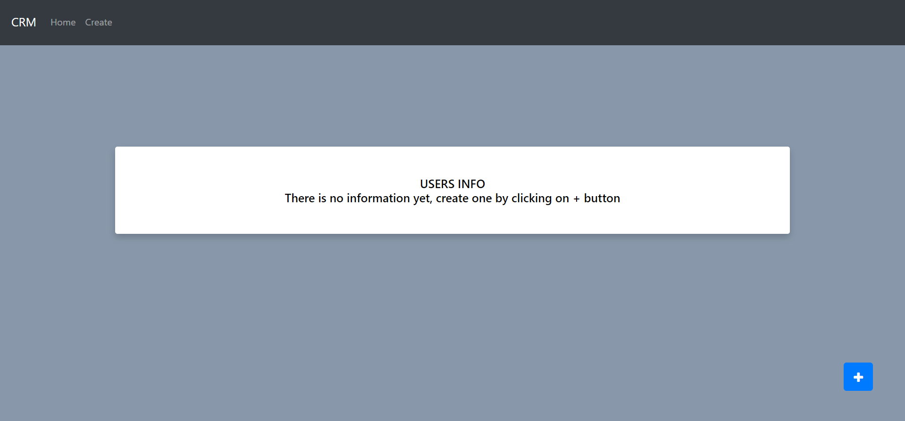
 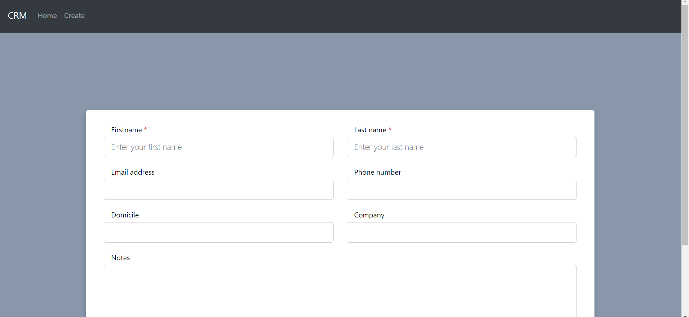
 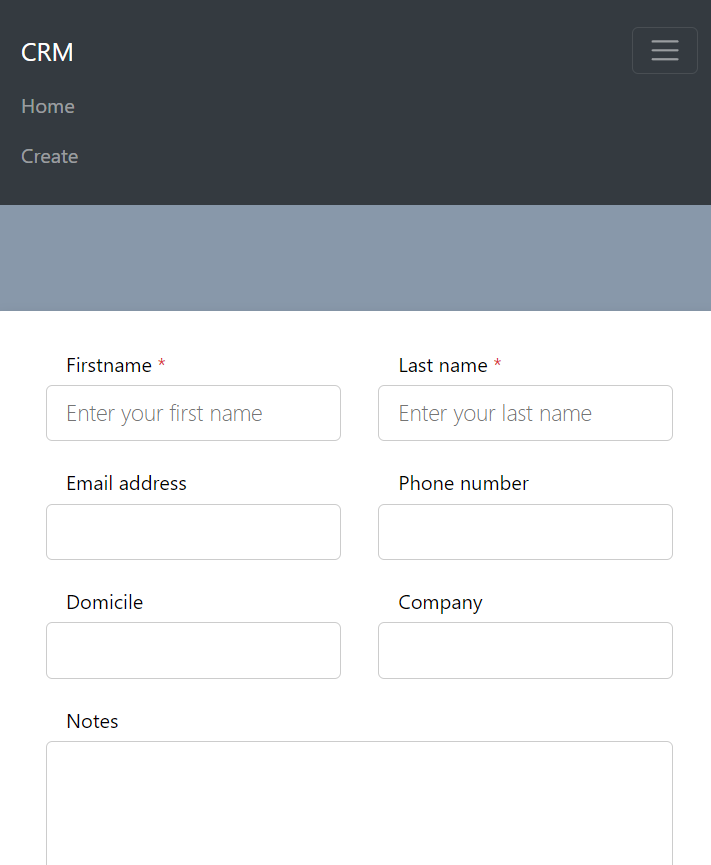
 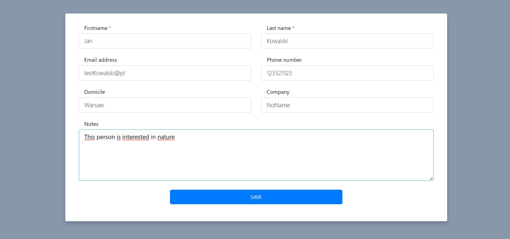
 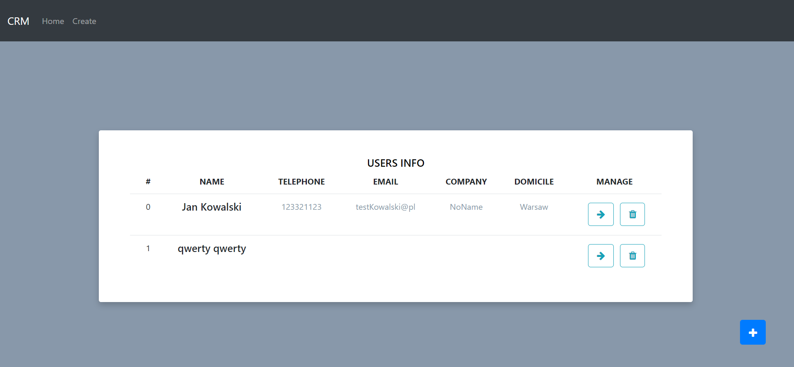
 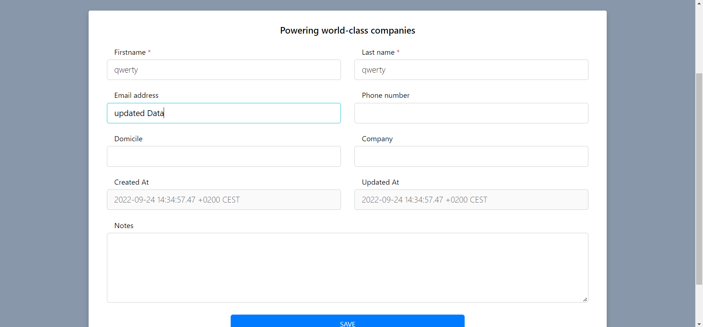
 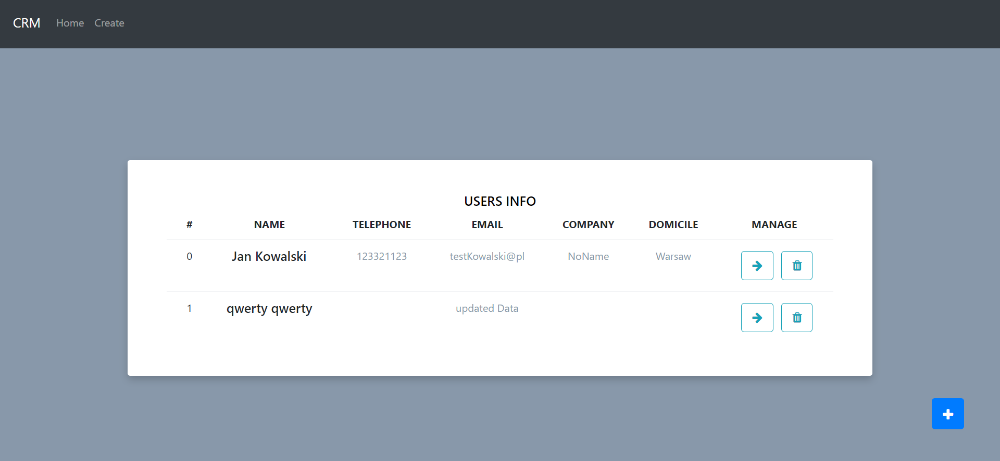
 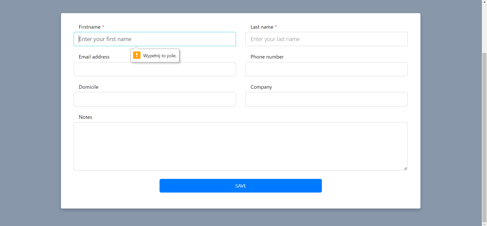
 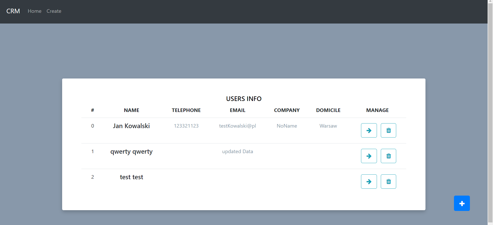
 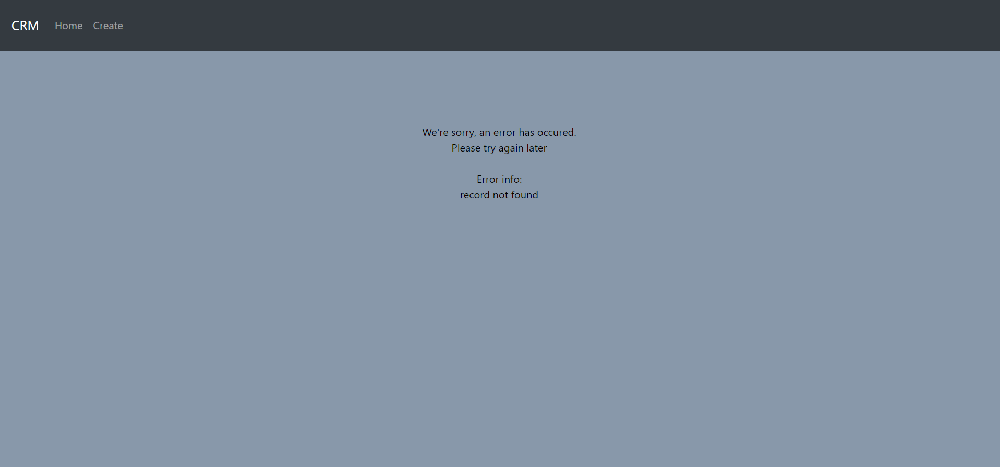
 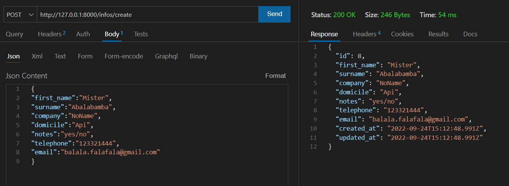
 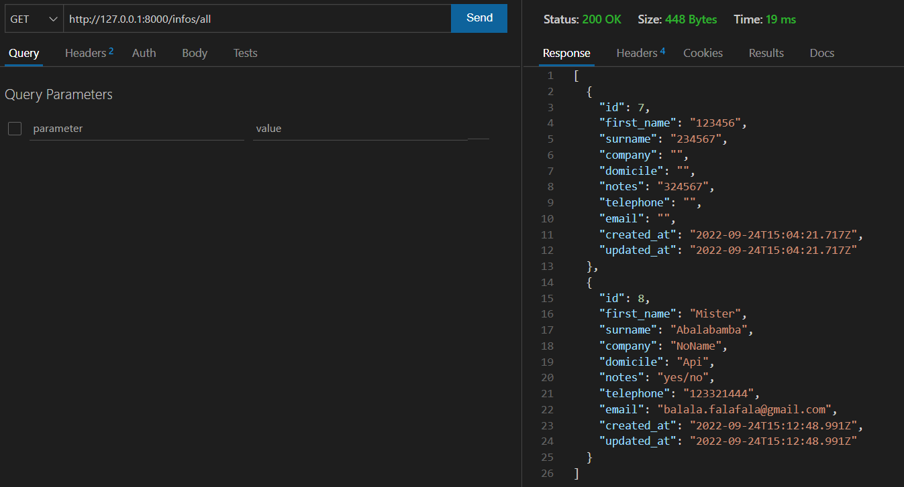
 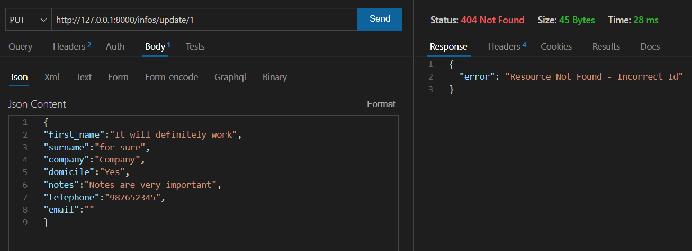
 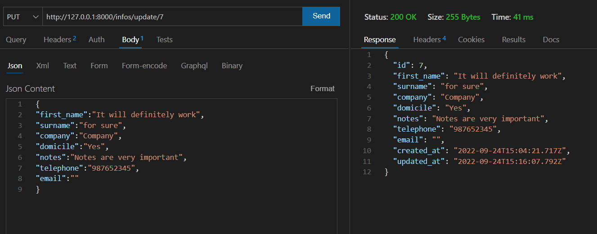
 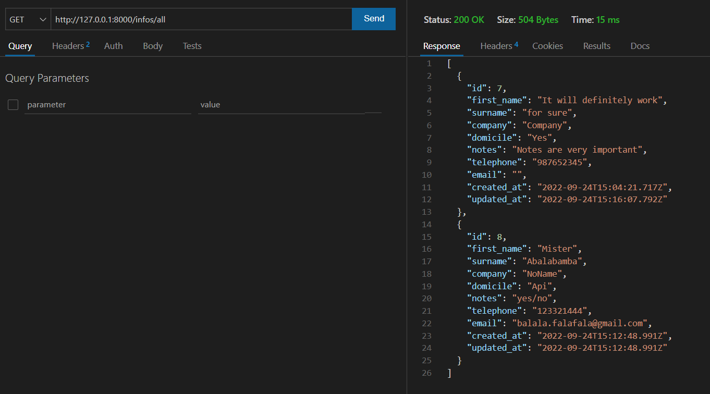
 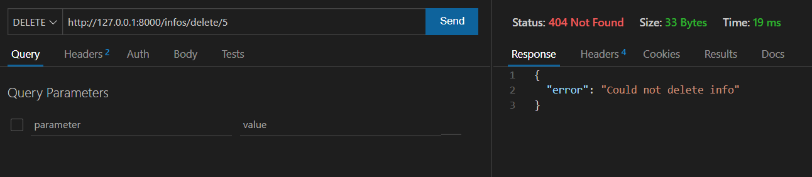
 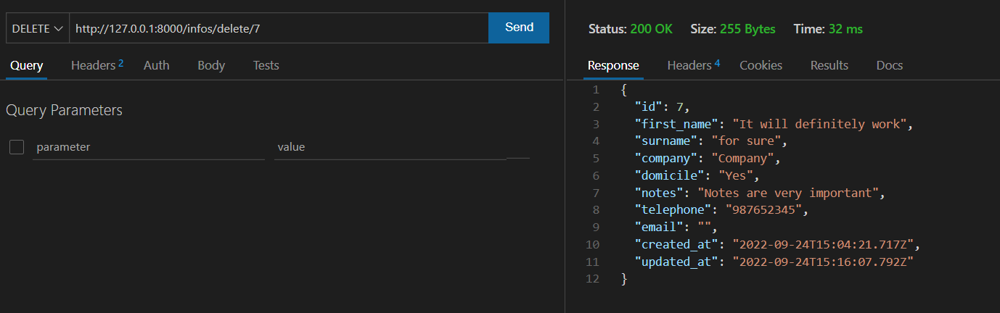

